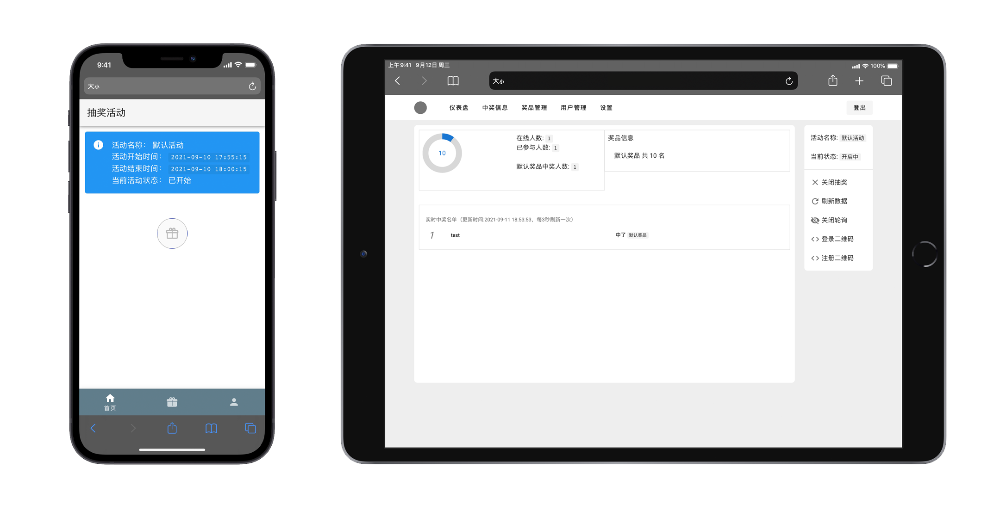

# 抽奖系统 :gift:
一个主要由Go语言编写的抽奖系统，使用了Redis+Mysql，用户端页面适配移动端

许多设计还存在不合理的地方，仅作为自己入门阶段的一个小作业

***



***

# 目录

- [功能特性](#功能特性)
- [环境依赖](#环境依赖)
- [使用](#使用)
- [demo](#demo)
- [申请试用](#申请试用)
- [License](#license)

# 功能特性
- [x] :star2:支持数据大屏，实时显示在线人数、参与人数、中奖记录等
- [x] :horse:支持让用户扫码登录/注册
- [x] :page_facing_up:支持从Excel批量导入用户
- [x] :ghost:支持设置“内鬼”，保证指定用户获得指定奖项
- [x] :chart_with_upwards_trend:支持导出中奖记录
- [x] :alarm_clock:支持抽奖活动定时开启/关闭
- [ ] 管理员端页面适配移动端

# 环境依赖

`Go 1.16` + `Mysql` + `Redis`

# 使用

### 下载

```Bash
git clone https://github.com/rroy233/lottery.git
cd lottery
git clone https://github.com/rroy233/lottery-FrontEnd.git
mv lottery-FrontEnd template
cp config.example.yaml config.yaml
```

### mysql导入
将`\sql\mysql_all.sql`导入数据库

### 修改配置文件

修改`config.yaml`
设置数据库信息

### 运行
`go build && ./lottery2`

### 访问
默认地址: `http://localhost:9092`

# demo

[在线演示地址](https://cj.roy233.com/admin)

用户名:`cjadmin`

密码:`cjadmin`


# 申请试用

本系统还将长期处于试验阶段

管理员账号注册需要注册码，不嫌弃的话可以找QQ:2867984618免费索要

# License
MIT